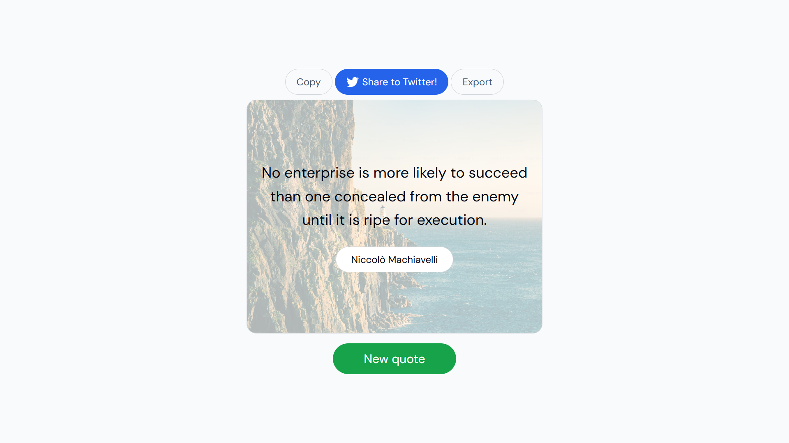

# Quote Generator Application

## Features

- Fetch a random quote from the API.
- Display the quote and author on the page.
- Add a "New Quote" button to fetch another quote.
- Implement a copy to clipboard button.
- Add a share on Twitter button.
- Add a "Export" button to save the quote image to user computer.
- Set a random background image behind the quote.

## Screenshots

## Deployment Link
[Live Demo](https://quote-generator-dwcq.onrender.com)

## How to Use
Open the app in your browser using the provided live demo link. A random quote is displayed on load, and you can fetch a new one by clicking the "New Quote" button. Use the "Copy to Clipboard" button to copy the quote or the "Share on Twitter" button to tweet it. Click the "Export" button to save the quote as an image with a dynamic background.

## Installation
Clone the repository:
git clone https://github.com/janarahul1234/Quote-Generator.git
Open index.html in a browser.
Start tracking your moods!

### Technologies Used
- HTML
- CSS
- JavaScript

## Contributing
Feel free to submit issues or pull requests to improve the application.

## License
This project is open-source and available under the [MIT License](LICENSE).
